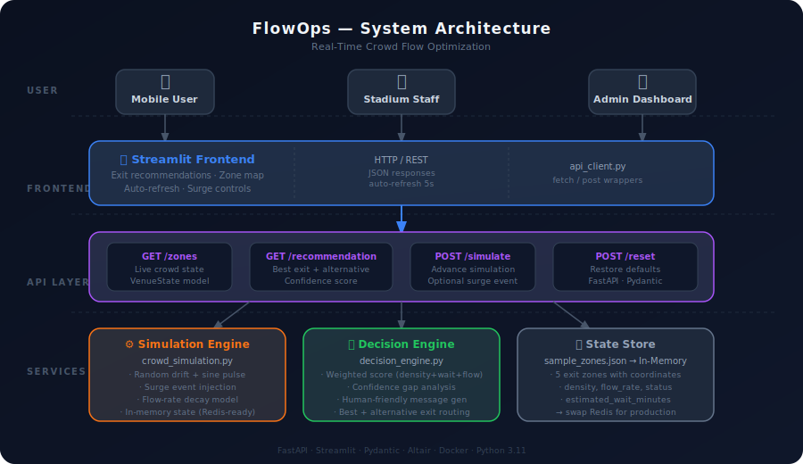

# 🏟️ FlowOps — Real-Time Crowd Flow Optimization

> **"We built a real-time decision system that optimizes stadium exit flow using dynamic crowd state analysis and adaptive routing — reducing congestion without requiring additional infrastructure."**


---

## 🧨 The Problem

In large events (cricket matches, concerts, sports finals):

- 50,000+ people try to leave **at the same time**
- Everyone defaults to the **nearest or most visible exit**
- Result: dangerous congestion, long waits, safety risks

**Existing solutions:** physical signage, human marshals — both slow and static.

---

## 💡 The Solution

FlowOps is a **real-time intelligent routing system** that:

| Feature | Detail |
|---|---|
| 🔍 Monitors crowd density | Per-zone, updated continuously |
| 🧠 Recommends best exit | Weighted scoring: density + wait + flow |
| 🔄 Adapts in real time | Simulation tick every 5s |
| 📱 Delivers clear UX | Simple: zone name + estimated wait |
| ☁️ Deployable anywhere | Docker + Cloud Run / Render |

---

## 🏗️ System Architecture

```
User (Mobile / Staff / Admin)
         │
         ▼
┌─────────────────────────┐
│   Streamlit Frontend    │  ← Exit map, recommendation banner,
│   frontend/app.py       │    zone cards, density chart
└────────────┬────────────┘
             │ HTTP / REST (JSON)
             ▼
┌─────────────────────────────────────────────────┐
│              FastAPI Backend                    │
│  GET  /zones          → VenueState              │
│  GET  /recommendation → Best exit + confidence  │
│  POST /simulate       → Advance simulation tick │
│  POST /reset          → Restore defaults        │
└──────┬──────────────────────────┬───────────────┘
       │                          │
       ▼                          ▼
┌──────────────┐        ┌──────────────────────┐
│  Simulation  │        │   Decision Engine    │
│  Engine      │◄──────►│   Weighted Scorer    │
│  crowd_sim.. │        │   decision_engine.py │
└──────┬───────┘        └──────────────────────┘
       │
       ▼
┌──────────────┐
│ State Store  │  (in-memory → Redis-ready)
│ zones JSON   │
└──────────────┘
```



---

## 📁 Project Structure

```
flowops-smart-venue/
│
├── README.md
├── requirements.txt
├── .env.example
├── .gitignore
│
├── architecture/
│   └── system_design.svg        ← Full system diagram
│
├── backend/
│   ├── app.py                   ← FastAPI entry point
│   ├── routes/
│   │   ├── zones.py             ← GET /zones
│   │   └── recommendation.py    ← GET /recommendation, POST /simulate, /reset
│   ├── services/
│   │   ├── crowd_simulation.py  ← Real-time simulation engine
│   │   └── decision_engine.py   ← Weighted scoring + recommendation logic
│   ├── models/
│   │   └── schema.py            ← Pydantic request/response models
│   └── utils/
│       └── helpers.py           ← Shared utility functions
│
├── frontend/
│   ├── app.py                   ← Streamlit dashboard
│   ├── components/
│   │   └── ui_elements.py       ← Zone cards, banners, charts
│   └── services/
│       └── api_client.py        ← HTTP wrapper for backend calls
│
├── data/
│   └── sample_zones.json        ← 5-exit venue with crowd state
│
├── docker/
│   ├── Dockerfile
│   └── docker-compose.yml
│
└── tests/
    └── test_api.py              ← Full API integration test suite
```

---

## 🚀 Quick Start

### Option 1 — Local (recommended for development)

```bash
# 1. Clone the repo
git clone https://github.com/YOUR_USERNAME/flowops-smart-venue.git
cd flowops-smart-venue

# 2. Create virtual environment
python -m venv .venv
source .venv/bin/activate      # Windows: .venv\Scripts\activate

# 3. Install dependencies
pip install -r requirements.txt

# 4. Start the backend (Terminal 1)
uvicorn backend.app:app --reload --port 8000

# 5. Start the frontend (Terminal 2)
streamlit run frontend/app.py
```

| Service  | URL |
|---|---|
| 🌐 Frontend | http://localhost:8501 |
| 📡 API Docs | http://localhost:8000/docs |
| ❤️ Health   | http://localhost:8000/health |

---

### Option 2 — Docker Compose (one command)

```bash
cd docker
docker-compose up --build
```

- Frontend → http://localhost:8501
- Backend  → http://localhost:8000

---

## 🧪 Running Tests

```bash
pytest tests/test_api.py -v
```

**Test coverage:**
- ✅ Health check
- ✅ Zone state schema validation
- ✅ Recommendation confidence bounds
- ✅ Multi-tick simulation
- ✅ Surge event injection
- ✅ Reset to defaults

---

## 🧠 Core Logic

### Simulation Engine (`crowd_simulation.py`)

```python
def tick(surge_zone=None, surge_magnitude=0.2):
    for zone in zones:
        drift  = random.uniform(-0.08, 0.06)    # natural movement
        drift -= zone["density"] * 0.05          # denser = drains faster
        drift += surge_magnitude if surge        # optional crowd spike
        drift += 0.02 * sin(time / 60)           # sine pulse (feels alive)

        zone["density"]       = clamp(density + drift, 0, 1)
        zone["flow_rate"]     = 700 * (1 - density * 0.7)
        zone["status"]        = density_to_status(density)
        zone["wait_minutes"]  = crowd / flow_rate
```

### Decision Engine (`decision_engine.py`)

```python
def score(zone):
    return (
        zone["density"]      * 0.50 +   # primary: how crowded?
        wait_normalized      * 0.30 +   # secondary: queuing time?
        flow_inverted        * 0.20     # tertiary: throughput?
    )

best = min(zones, key=score)
```

**Lower score = better exit.** Simple, explainable, tunable.

---

## 📊 API Reference

| Method | Endpoint | Description |
|---|---|---|
| `GET` | `/zones/` | Full venue crowd state |
| `GET` | `/recommendation` | Best exit + confidence score |
| `POST` | `/simulate` | Advance simulation (supports surges) |
| `POST` | `/reset` | Restore default crowd state |
| `GET` | `/health` | Service health check |

Full interactive docs: **`/docs`** (Swagger UI)

---

## 🌐 Deployment

### Deploy to Render (free tier)

```
1. Push repo to GitHub
2. Create new Web Service on render.com
3. Build command:  pip install -r requirements.txt
4. Start command:  uvicorn backend.app:app --host 0.0.0.0 --port $PORT
5. Deploy ✅
```

### Deploy Frontend to Streamlit Cloud

```
1. Push repo to GitHub
2. Go to share.streamlit.io
3. Select repo → Main file: frontend/app.py
4. Set BACKEND_URL in secrets
5. Deploy ✅
```

---

## 🔭 What's Next (Production Roadmap)

| Feature | Tech |
|---|---|
| Live sensor data ingestion | Kafka topics per zone |
| Persistent crowd history | Redis time-series |
| ML-based surge prediction | scikit-learn / Prophet |
| Push notifications to attendees | FCM / APNs |
| Real hardware integration | RTSP camera feeds + CV |

---

## 👨‍💻 Built With

- **[FastAPI](https://fastapi.tiangolo.com/)** — async Python API framework
- **[Streamlit](https://streamlit.io/)** — rapid data app UI
- **[Pydantic v2](https://docs.pydantic.dev/)** — data validation & schemas
- **[Altair](https://altair-viz.github.io/)** — declarative charting
- **[Docker](https://www.docker.com/)** — containerized deployment

---

## 📄 License

MIT © 2025 — FlowOps
